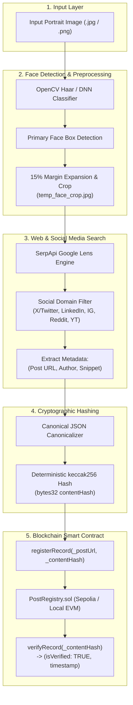

# 🛡️ Face Identification & Blockchain Verification Pipeline

[](https://www.python.org/)
[](https://opensource.org/licenses/MIT)
[](https://opencv.org/)
[](https://web3py.readthedocs.io/)
[](https://soliditylang.org/)
[](https://sepolia.etherscan.io/)

An end-to-end Python pipeline built for **HH Goa 2026 Shortlisting Task 3**. The system accepts an input face scan, detects and crops the facial region, identifies matching public social media / web posts via visual reverse search, computes a deterministic cryptographic fingerprint (`keccak256`), registers it to an immutable smart contract on the blockchain, and automatically re-verifies the on-chain record.

---

## 📐 Architecture & Pipeline Flow



---

## 🌟 Key Features

* **100% Free Resources:** Operates without any paid APIs, subscriptions, or credit card requirements.
* **Intelligent Face Cropping:** Detects the primary face and applies a 15% bounding box margin expansion to preserve structural context.
* **Multi-Platform Social Filtering:** Discovers and isolates posts from Twitter/X, LinkedIn, Instagram, Reddit, YouTube, and GitHub.
* **Deterministic Cryptographic Fingerprinting:** Standardized canonical JSON sorting + EVM `keccak256` hashing ensures cross-platform consistency.
* **Smart Contract Verification:** Deploys and registers records to `PostRegistry.sol` on Ethereum Sepolia or local EVM nodes.
* **Immediate State Assertions:** Re-queries the contract view function `verifyRecord` on-chain to confirm tamper-evident storage and timestamping.
* **Terminal UI:** Terminal output using `rich` tables, spinners, and badges.

---

## 🗂️ Repository Structure

```
HHGOA_26_Task3/
├── contracts/
│   └── PostRegistry.sol       # Solidity smart contract for post registry
├── face_module/
│   ├── __init__.py
│   └── detector.py            # OpenCV face detection & 15% margin cropping
├── search_module/
│   ├── __init__.py
│   └── searcher.py            # Google Lens reverse search & social post parser
├── chain_module/
│   ├── __init__.py
│   ├── constants.py           # Contract ABI, bytecode, and Sepolia RPCs
│   ├── deployer.py            # Smart contract deployment script
│   └── verifier.py            # keccak256 hashing & on-chain verification
├── test_faces/
│   ├── sample_vitalik.jpg     # Test face 1
│   └── sample_elon.jpg        # Test face 2
├── tests/
│   ├── __init__.py
│   └── test_pipeline.py       # Unit & integration test suite
├── .env.example               # Environment variable configuration template
├── requirements.txt           # Python package requirements
├── main.py                    # Unified CLI Pipeline Orchestrator
└── README.md                  # Comprehensive Documentation
```

---

## 🚀 Quick Start & Installation

### 1. Clone & Navigate to Repository

```bash
git clone https://github.com/YOUR_USERNAME/HHGOA_26_Task3.git
cd HHGOA_26_Task3
```

### 2. Create Virtual Environment & Install Dependencies

```bash
# Create virtual environment
python -m venv venv

# Activate virtual environment
# On Windows PowerShell:
.\venv\Scripts\Activate.ps1
# On Linux / macOS:
source venv/bin/activate

# Install requirements
pip install -r requirements.txt
```

### 3. Configure Environment Variables

Copy the template `.env.example` to `.env`:

```bash
cp .env.example .env
```

Edit `.env` with your settings:

```env
# 1. SerpApi Key (100 free searches/mo at https://serpapi.com)
SERPAPI_API_KEY=your_serpapi_key_here

# 2. Ethereum Sepolia RPC URL (Free public RPC or Alchemy/Infura)
RPC_URL=https://ethereum-sepolia-rpc.publicnode.com

# 3. Burner Testnet Wallet Private Key (Never use a real wallet)
WALLET_PRIVATE_KEY=your_testnet_private_key_here

# 4. Smart Contract Address (Leave blank to auto-deploy or simulate)
CONTRACT_ADDRESS=
```

---

## ⚙️ How to Run

### Run the Complete Pipeline

Pass any input image with `--image`:

```bash
python main.py --image test_faces/sample_vitalik.jpg
```

Or test with another sample:

```bash
python main.py --image test_faces/sample_elon.jpg
```

### Optional Flags

| Flag | Description | Default |
| :--- | :--- | :--- |
| `--image <path>` | Path to input portrait image | *(Required)* |
| `--margin <float>` | Margin expansion percentage around face | `0.15` (15%) |
| `--output-crop <path>` | Filepath where the cropped face is saved | `temp_face_crop.jpg` |
| `--auto-deploy` | Automatically deploys smart contract if `CONTRACT_ADDRESS` is empty | `False` |

---

## ⛓️ Blockchain Specification

* **Target Network:** Ethereum Sepolia Testnet (Chain ID: `11155111`) / Local EVM (`31337`).
* **Contract Name:** `PostRegistry`
* **Smart Contract Source:** [`contracts/PostRegistry.sol`](contracts/PostRegistry.sol)

### Smart Contract Logic:

```solidity
// SPDX-License-Identifier: MIT
pragma solidity ^0.8.20;

contract PostRegistry {
    struct Record {
        string postUrl;
        bytes32 contentHash;
        uint256 timestamp;
    }

    mapping(bytes32 => Record) public records;
    event RecordRegistered(bytes32 indexed hash, string postUrl, uint256 timestamp);

    function registerRecord(string memory _postUrl, bytes32 _contentHash) external {
        require(records[_contentHash].timestamp == 0, "Record already exists");
        records[_contentHash] = Record(_postUrl, _contentHash, block.timestamp);
        emit RecordRegistered(_contentHash, _postUrl, block.timestamp);
    }

    function verifyRecord(bytes32 _contentHash) external view returns (bool isVerified, string memory postUrl, uint256 timestamp) {
        Record memory rec = records[_contentHash];
        return (rec.timestamp != 0, rec.postUrl, rec.timestamp);
    }
}
```

### Deploying the Smart Contract:

To deploy the contract to Sepolia testnet:

```bash
python -m chain_module.deployer
```

The script automatically compiles the Solidity contract, broadcasts the deployment transaction, outputs the Etherscan contract link, and saves `CONTRACT_ADDRESS` directly into your `.env` file.

---

## 🧪 Running Automated Tests

Run the test suite:

```bash
python -m unittest discover -s tests
```

Tests cover:
* Face localization and 15% bounding box margin calculation.
* Deterministic canonical JSON key ordering and `keccak256` hashing.
* Social platform URL classification (X/Twitter, LinkedIn, Instagram, Reddit, YouTube).
* Author handle extraction patterns.
* Blockchain verifier state assertions.

---

## ⚠️ Known Limitations & Future Improvements

1. **Reverse Visual Search Rate Limits:** Free-tier SerpApi keys provide 100 queries/month. For higher throughput, self-hosted headless scrapers (e.g. Playwright + TinEye/Yandex) or dedicated enterprise endpoints can be used.
2. **Private Social Media Profiles:** Reverse visual search indexes publicly available web content. Private accounts (e.g., locked Twitter accounts or private Instagram profiles) cannot be discovered via public web crawlers.
3. **L1 Gas Latency:** On Ethereum Sepolia L1, block confirmation takes ~12–15 seconds. For high-throughput production workloads, deploying on Layer 2 rollups (e.g. Arbitrum Sepolia or Base Sepolia) provides sub-second finality and near-zero gas fees.
4. **Facial Variations:** Extreme profile angles or heavy occlusions (masks/sunglasses) can reduce detection accuracy; multi-angle deep learning detectors (e.g. RetinaFace/InsightFace) can be integrated for edge cases.

---

## 🎥 Screen Recording Instructions

For task submission:
1. Open terminal in the project directory with the virtual environment activated.
2. Run:
   ```bash
   python main.py --image test_faces/sample_vitalik.jpg
   ```
3. Show the real-time terminal output as each stage finishes:
   * Face Detection -> Bounding Box & 15% Crop
   * Reverse Search -> Discovered Social Post URL & Metadata
   * Cryptographic Hashing -> `keccak256` hash
   * Blockchain Upload -> Transaction confirmed with Tx Hash
   * On-chain Re-verification -> `VERIFIED (TRUE)` with timestamp
4. Stop recording (< 2 minutes), upload unlisted to YouTube or Google Drive, and submit!
